# Target Control Plane Component Architecture

## Role of the Control Plane

In the target design, the current backend evolves into a real **control plane**.

It should no longer be a mixed API server plus stream proxy plus worker runtime.
Instead, it becomes the authoritative system layer that:

- owns all business metadata,
- exposes public and internal APIs,
- validates contracts,
- coordinates workers,
- computes policy,
- tracks durable jobs,
- publishes snapshots to the rest of the platform.

## Responsibilities That Stay in the Control Plane

- Camera registry and source inventory.
- Credential management and masking.
- Discovery session lifecycle.
- Device control APIs.
- Stream session orchestration and policy decisions.
- Observation ingest and recording catalog.
- Health policy aggregation and metrics export.
- Map job orchestration, validation, versioning, and promotion.
- Contract validation and schema versioning.

## Responsibilities That Move Out

- Long-lived browser stream byte fan-out.
- Raw ffmpeg keepalive ownership.
- Detector-local recording metadata authority.
- Duplicate fallback map generation logic.
- Worker-local configuration discovery from shared files.

## C4 Component Diagram

```mermaid
C4Component
title Target Component View - Control Plane

Container(frontend, "Frontend", "React", "Browser UI")
Container(stream_gateway, "Stream Gateway", "Worker", "Session runtime and stream delivery")
Container(perception, "Perception Service", "Worker", "Observations and recording intents")
Container(mapper, "Mapper", "Worker", "Map strategies and spatial inference")
ContainerDb(metadata_store, "Metadata Store", "SQL", "Authoritative metadata")
ContainerDb(media_store, "Media Store", "Filesystem/Object storage", "Recordings and exports")
System_Ext(cameras, "ONVIF / RTSP Cameras", "Physical devices")

Container_Boundary(control_plane_boundary, "Control Plane") {
  Component(api_gateway, "API Gateway / BFF", "HTTP API", "Single frontend-facing entrypoint")
  Component(camera_registry, "Camera Registry", "Domain service", "Cameras, sources, credentials, lifecycle state")
  Component(discovery_coordinator, "Discovery Coordinator", "Domain service", "Discovery sessions and candidate evaluation")
  Component(device_control, "Device Control Service", "Domain service", "PTZ, snapshots, auxiliary commands")
  Component(stream_orchestrator, "Stream Session Orchestrator", "Domain service", "Session intents, source policy, stream capability negotiation")
  Component(observation_ingest, "Observation Ingest Service", "Domain service", "Stores motion and detection events from workers")
  Component(recording_catalog, "Recording Catalog Service", "Domain service", "Recording metadata, search, retention, deletion")
  Component(health_engine, "Health Engine", "Domain service", "Probe aggregation, health policy, metrics snapshots")
  Component(map_orchestrator, "Map Orchestrator", "Domain service", "Durable map jobs, versioning, promotion, correction history")
  Component(job_runtime, "Job Runtime", "Internal queue runner", "Reliable background work execution")
  Component(contract_validation, "Contract Validation", "Schema layer", "Shared request, response, and event validation")
}

Rel(frontend, api_gateway, "Calls")
Rel(api_gateway, camera_registry, "Uses")
Rel(api_gateway, discovery_coordinator, "Uses")
Rel(api_gateway, device_control, "Uses")
Rel(api_gateway, stream_orchestrator, "Uses")
Rel(api_gateway, recording_catalog, "Uses")
Rel(api_gateway, health_engine, "Uses")
Rel(api_gateway, map_orchestrator, "Uses")

Rel(discovery_coordinator, cameras, "Probes and evaluates")
Rel(device_control, cameras, "Sends ONVIF commands")
Rel(stream_orchestrator, stream_gateway, "Creates and monitors sessions")
Rel(stream_orchestrator, camera_registry, "Reads source policy")
Rel(observation_ingest, perception, "Receives observation events")
Rel(recording_catalog, perception, "Receives recording completion and metadata")
Rel(health_engine, stream_gateway, "Reads stream metrics")
Rel(map_orchestrator, mapper, "Submits jobs and receives results")
Rel(map_orchestrator, observation_ingest, "Reads normalized observations")

Rel(camera_registry, metadata_store, "Reads and writes")
Rel(observation_ingest, metadata_store, "Writes")
Rel(recording_catalog, metadata_store, "Reads and writes")
Rel(health_engine, metadata_store, "Reads and writes snapshots")
Rel(map_orchestrator, metadata_store, "Reads and writes")
Rel(recording_catalog, media_store, "Indexes stored files")
Rel(map_orchestrator, media_store, "Stores immutable map exports")
Rel(contract_validation, metadata_store, "Guards data boundaries")
```



## Target Internal Domains

### Camera registry

The camera registry is the only place that owns:

- camera identity,
- normalized source definitions,
- labels and source roles,
- encrypted credentials,
- desired processing capabilities.

At-rest credential encryption can be enabled with `CAMERA_CREDENTIALS_MASTER_KEY`, allowing repositories to persist encrypted secrets while domains continue to consume decrypted credentials in-memory.

Camera-control and discovery APIs are served under `/api/cameras/*` as the canonical namespace.

### Discovery coordinator

Discovery becomes a tracked workflow instead of a one-shot controller action.
It should manage:

- discovery sessions,
- discovered candidates,
- validation results,
- onboarding decisions.

### Stream session orchestrator

This domain decides:

- which logical source policy to use,
- whether reconstructed or direct delivery is allowed,
- what protocol to offer the client,
- what health fallback to apply when a source degrades.

During migration, this domain can expose internal operational APIs for control-plane operators, for example:

- `GET /api/streams/capabilities`
- `GET /api/streams/runtime`
- `POST /api/streams/sync`
- `GET /api/internal/config/streams`

Runtime toggles such as `STREAM_RUNTIME_ENABLED` and `STREAM_WEBSOCKET_GATEWAY_ENABLED` allow decoupling stream runtime lifecycle from the main control-plane HTTP process while extraction proceeds.
Transport negotiation can be staged with `STREAM_WEBRTC_ENABLED` and `STREAM_WEBRTC_REQUIRE_HTTPS` while keeping JSMpeg fallback enabled.
When stream runtime is externalized, control-plane stream APIs can proxy to `STREAM_GATEWAY_API_URL` while preserving the same frontend contracts.

### Observation ingest

This domain is the contract boundary between perception workers and the rest of the system.
It stores normalized events instead of letting other modules scrape detector-local logs.

Incremental ingest endpoints can be:

- `POST /api/perception/observations`
- `GET /api/perception/observations`

### Recording catalog

Recording metadata should move out of the detector and into the control plane.
The detector or recording worker produces artifacts; the control plane owns the searchable catalog and retention policy.

Incremental catalog endpoints can be:

- `POST /api/perception/recordings`
- `GET /api/recordings`
- `DELETE /api/recordings/:filename`

Operational retention is controlled by background policies in the control plane runtime (`RECORDING_RETENTION_ENABLED`, `RECORDING_RETENTION_INTERVAL_MS`, `RECORDING_RETENTION_MAX_AGE_DAYS`, `RECORDING_RETENTION_MAX_ENTRIES`).

### Worker configuration snapshots

Workers should consume explicit internal snapshots instead of reading shared files.
During migration the control plane can expose:

- `GET /api/internal/config/cameras`
- `GET /api/internal/config/streams`
- `GET /api/internal/config/retention`

The retention snapshot includes both control-plane catalog policy (`recordingCatalog`) and detector recycle compatibility policy (`detectorRecycle`) so workers can align runtime behavior while legacy local cleanup paths are still active.

When snapshot consumption is stable, worker deployments should stop mounting shared `backend/data` volumes for camera config reads.

### Metadata repositories and compatibility exports

Control-plane domains should persist authoritative state in dedicated metadata repositories.
Compatibility exports (for example legacy `cameras.json` or recording index files) can remain dual-written temporarily when `LEGACY_COMPAT_EXPORTS_ENABLED=1`, but they are generated outputs, not the source of truth.
The same compatibility gate applies to map/correction JSON artifacts and health snapshot legacy files; migration utilities can still force one-time bootstrap from legacy JSON when needed.

### Health engine

The health engine combines:

- source probe data,
- stream gateway metrics,
- event freshness,
- observation health,
- optional ONVIF event freshness.

For operations, the control plane also exposes explicit probe endpoints:

- `GET /api/health/live`
- `GET /api/health/ready`
- `GET /livez`
- `GET /readyz`

### Map orchestrator

The control plane should coordinate map jobs but not own map inference strategies.
It submits work to the mapper domain and owns:

- queueing,
- retries,
- promotion,
- correction history,
- lifecycle policy.

## Recommended Code Shape

The target code shape inside the current backend repository should be domain-oriented, for example:

```text
backend/src/
  app/
  contracts/
  domains/
    cameras/
    discovery/
    device-control/
    streams/
    observations/
    recordings/
    health/
    maps/
  infrastructure/
    db/
    media/
    logging/
    queue/
    http/
  workers/
```

The exact folder names may vary, but the important point is that routes become a thin shell around domain services instead of being the place where business logic lives.
