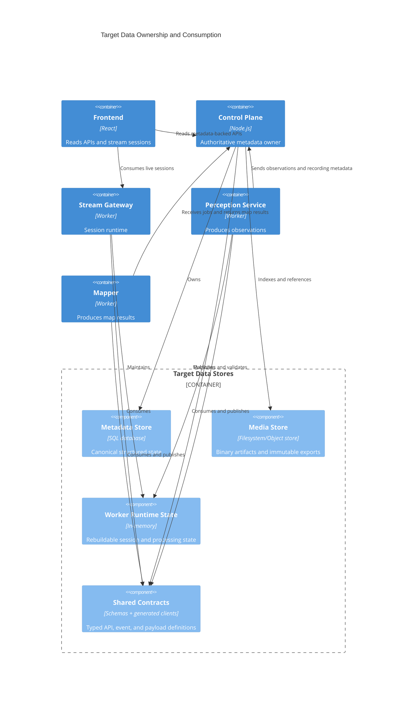
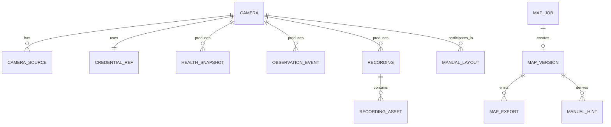

# Target Data and Artifact Relationships

## Purpose

The target design replaces file-level coupling with explicit ownership boundaries.

The key rule is:

**metadata is authoritative in one place, media artifacts are stored separately, and worker-local runtime state is disposable.**

## Target Data Stores

### 1. Metadata Store

The metadata store is the authoritative source of truth for structured state.

Recommended initial implementation:

- SQLite-backed repository inside the control plane for the first migration step.

Upgrade path:

- PostgreSQL without changing the domain contracts.

The metadata store should own:

- cameras,
- camera sources,
- encrypted credentials,
- discovery sessions and candidates,
- stream session records,
- health snapshots,
- observations,
- recording catalog rows,
- map jobs,
- map versions,
- manual corrections and layout hints.

### 2. Media Store

The media store keeps binary or immutable export artifacts:

- `.mp4` recordings,
- thumbnails,
- map export bundles,
- optional debug frames,
- generated reports.

The media store is not the authoritative source of metadata.
It is referenced by the metadata store.

### 3. Runtime Cache / Worker State

Each worker can keep transient runtime state such as:

- active stream sessions,
- detector buffers,
- reconstructor frame windows,
- probe histories,
- background job leases.

This state should be reconstructable and should not be the only place where business facts exist.

## Core Target Entities

### Camera domain

- `Camera`
- `CameraSource`
- `CredentialRef`
- `DiscoveryCandidate`
- `DeviceCapability`

### Stream domain

- `StreamSession`
- `StreamPolicy`
- `SourceHealth`
- `DeliveryCapability`

### Observation domain

- `ObservationEvent`
- `MotionSignal`
- `Detection`
- `ObservationBatch`

### Recording domain

- `Recording`
- `RecordingAsset`
- `RetentionPolicy`

### Mapping domain

- `MapJob`
- `MapVersion`
- `MapExport`
- `ManualLayout`
- `ManualHint`

### Monitoring domain

- `HealthSnapshot`
- `ProbeSample`
- `MetricSeriesSummary`

## C4 Component Diagram for Data Ownership

## Recommended Entity Relationships

## What Becomes Deprecated

The following artifacts should stop being used as the system integration boundary:

- `backend/data/cameras.json`
- `backend/data/maps/index.json`
- `backend/data/maps/jobs.json`
- `recordings/recordings-index.json`
- `*.meta.json` sidecars as authoritative catalog state

They may continue to exist temporarily as migration compatibility outputs or export formats, but not as the canonical source of truth.

## Artifact Lifecycle by Capability

### Discovery and onboarding

- Create discovery session rows.
- Store candidates and validation results.
- Commit camera, source, and credential records.
- Emit configuration snapshots for workers.

### Streaming

- Create or renew logical stream sessions.
- Store only lightweight session metadata and health, not frame payloads.

### Observations and recordings

- Workers publish normalized observation events.
- Control plane persists observations.
- Recording worker stores files in media store.
- Recording catalog persists searchable metadata in metadata store.

### Monitoring

- Probe samples are summarized into current health snapshots.
- Metrics are exported from the snapshot model instead of being assembled ad hoc.

### Mapping

- Map jobs read normalized observations and camera topology.
- Mapper returns a validated result payload.
- Control plane stores a map version row plus immutable JSON export artifact.

## Architectural Consequence

Once the target model is in place, every major capability can evolve independently without needing to read or rewrite another service's files.
