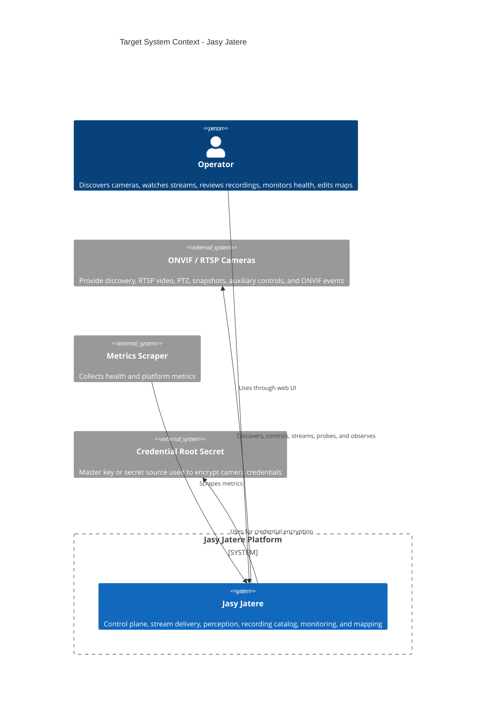
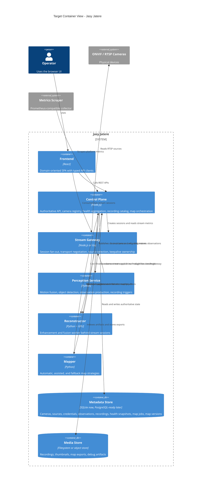

# Target Architecture Overview

## Purpose

The target design keeps the same product goals as the current platform, but restructures the system so it is easier to evolve, safer to operate, and cleaner to scale.

The platform must still support:

1. ONVIF discovery and device onboarding.
2. Live viewing and device control.
3. Observation, motion, and recording workflows.
4. Connectivity monitoring and metrics.
5. Croquis map generation, manual correction, and version promotion.

The difference is that the future system should achieve those capabilities through explicit boundaries instead of implicit file sharing and cross-service coupling.

## Design Goals

### 1. One authoritative control plane

The backend should become the system authority for:

- cameras,
- camera sources,
- credentials,
- recordings catalog,
- observations,
- health snapshots,
- map jobs and map versions.

Other services should consume configuration from the control plane instead of reading local JSON files directly.

### 2. Clear separation between control plane and workers

The target platform separates:

- decision-making and state ownership,
- long-running media processing,
- GPU-heavy inference and enhancement,
- map generation strategies,
- media artifact production.

### 3. Typed contracts and versioned schemas

All service-to-service requests should be defined through shared contracts, not inferred from ad hoc JSON objects.

### 4. Durable metadata, local media

The system should use:

- a relational metadata store for authoritative state,
- a media store for recordings, thumbnails, and immutable exports.

### 5. Protocol abstraction for streaming

The browser should not depend on a specific internal transport implementation. The target stream gateway should be able to expose:

- WebRTC as the preferred low-latency path,
- WebSocket/JSMpeg as a compatibility fallback during migration.

## Architectural Style

The target design is a **control plane plus workers** architecture.

The control plane owns metadata, contracts, orchestration, and system APIs.
Worker services execute specialized media or inference tasks behind stable internal APIs.

## Target Runtime Containers

- `frontend`
- `control-plane`
- `stream-gateway`
- `perception-service`
- `reconstructor`
- `mapper`
- `metadata-store`
- `media-store`

## C4 Context Diagram

## C4 Container Diagram

## Target Platform Layers

### Frontend layer

- Browser-only UI.
- No knowledge of raw RTSP.
- Typed clients generated from shared contracts.
- Query-based data access instead of per-component fetch logic.

### Control plane layer

- The only authority for business state and lifecycle decisions.
- Exposes user-facing APIs and internal APIs.
- Owns orchestration, validation, persistence, and policy.

### Worker layer

- Stream gateway
- Perception worker
- Reconstructor worker
- Mapper worker

These services do not define the system source of truth.
They execute specialized work and report back.

### Storage layer

- Metadata store for structured state.
- Media store for files and immutable exports.

## What the Target Design Explicitly Removes

- Shared mutable JSON files as the integration mechanism between services.
- Backend-owned raw stream proxy logic mixed into the main API server.
- Duplicated map heuristics in both backend and mapper.
- Detector-side ownership of recording catalog metadata.
- Cross-service dependence on implicit object shapes.

## Migration Constraint

The redesign is intended to be incremental.
The existing services remain the starting point, but they should be moved behind the new boundaries one capability at a time.
